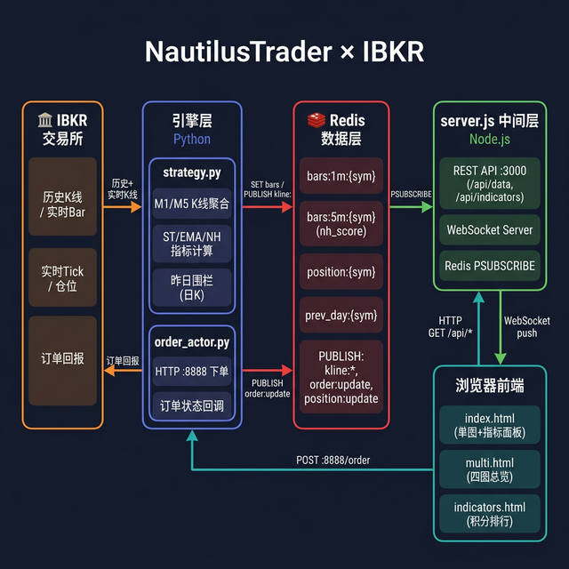

# 鹦鹉螺引擎 (NautilusTrader) × IBKR 实盘交易系统

> 个人量化交易基础设施 —— 用工业级框架，极少量代码，搭建生产可用的实盘系统。

基于 **NautilusTrader** 框架连接 **Interactive Brokers (IBKR)**，支持多标的实时 K 线、SuperTrend 指标计算、HTTP 下单网关和前端可视化 Dashboard。

---

## 项目目标

本项目的目标不是实现某一个具体的交易策略，而是搭建一套**完整、稳定、可扩展的个人量化基础设施**：

1. **数据层**：从 IBKR 获取实时和历史 K 线，经过计算后存入 Redis，供上层随时消费
2. **信号层**：在引擎内计算 SuperTrend、EMA、日内新高等技术指标，作为交易依据
3. **执行层**：通过 NautilusTrader 内置的风险引擎和订单管理系统，确保下单准确可靠
4. **展示层**：前端实时可视化 K 线、指标积分、仓位盈亏、语音提醒，辅助人工决策

这是一套**半自动**的系统——引擎负责数据和执行，人工负责信号判断和最终决策。

---

## 设计原则

| 原则 | 实现方式 |
|------|---------|
| **职责分离** | 引擎只计算，Redis 只传递，前端只展示，三层完全解耦 |
| **独立重启** | 任意一层重启，其余层不受影响，Redis 是唯一共享状态 |
| **数据溯源** | 全部数据来自 IBKR，无外部数据源依赖，回测与实盘使用同一套代码 |
| **少写代码** | 充分利用 NautilusTrader 的订单管理、风控、事件驱动能力，专注 alpha 逻辑 |
| **可扩展** | 标的数量、指标种类、前端展示均可独立扩展，互不影响 |

---

## 架构评价

> **NautilusTrader 的核心价值**：以 Rust 为核心的高性能事件驱动引擎，开箱即得以下工业级能力——

| 引擎内置能力 | 若自行实现需要的代码量 |
|------------|------------------|
| 完整订单生命周期状态机（ACCEPTED/FILLED/REJECTED 等） | ~500 行 |
| 风险引擎（仓位限制、资金校验） | ~300 行 |
| OCA 联动订单（止损触发自动取消关联单） | ~200 行 |
| IBKR 协议适配（合约查询、连接重试） | ~1000 行 |
| 回测/实盘通用接口 | ~800 行 |
| 纳秒级时间戳对齐、多标的事件排序 | ~300 行 |

**本项目实际编写的核心代码**：`strategy.py` ~450 行 + `order_actor.py` ~220 行，却获得了 3000+ 行才能实现的工业级可靠性。

**个人量化者视角**：这套架构已超过大多数个人量化基础设施的成熟度，具备真正的生产部署能力：
- ✅ 解耦、事件驱动、状态分离
- ✅ 实时指标计算 + 语音提醒 + 可视化 Dashboard
- ✅ 完整订单链路（下单 → 成交 → 仓位更新 → 止损管理）
- ⚠️ 下一步：Redis 告警 + 信号自动化 + 策略归档

---

## 项目结构

```
nautilus_ibkr_helloworld/
├── main.py            # 主程序：配置并启动 TradingNode（支持 --mode live/backtest）
├── strategy.py        # 回测/实盘通用策略：1m K 线 + SuperTrend + EMA + 日K围栏 + 写Redis
├── order_actor.py     # HTTP 下单网关 Actor（端口 8888）+ 订单状态 Redis 回调
├── order_sender.py    # 外部下单测试脚本（MARKET / BRACKET）
└── frontend/
    ├── server.js      # Node.js WebSocket 服务器，从 Redis 推送 K 线 + 指标给前端
    └── public/
        ├── index.html      # 单图 Dashboard（左K线 + 右指标面板 + 语音提醒）
        ├── multi.html      # 四图总览（2×2 网格，语音提醒）
        └── indicators.html # 四列指标排行（M1 ST / M5 ST / EMA偏离 / 日内新高）
```

## 架构设计



**三条核心数据链路：**

| 链路 | 路径 | 触发时机 |
|------|------|---------|
| 实时K线 | IBKR → strategy.py → Redis PUBLISH → server.js → WebSocket → 浏览器 | 每分钟K线收盘 |
| 指标轮询 | 浏览器 → HTTP GET /api/* → server.js → Redis GET | 每30秒 |
| 订单状态 | 浏览器下单 → order_actor.py → IBKR → Redis PUBLISH → WebSocket → 语音/Toast | 每次订单回报 |

> Redis 是三层之间唯一的共享状态，引擎 / server.js / 浏览器三者可独立重启，互不影响。

## 依赖

### Python
```bash
pip install uv
uv pip install "nautilus_trader[ib]" redis
```

### Node.js（前端）
```bash
cd frontend && npm install
```

### Redis
```bash
# macOS
brew install redis && brew services start redis

# 或 Docker
docker run -d -p 6379:6379 redis
```

## 环境准备

### 1. 启动 TWS 或 IB Gateway

- 登录 [TWS](https://www.interactivebrokers.com/en/trading/tws.php) 或 IB Gateway
- 开启 API 连接：`Edit → Global Configuration → API → Settings → Enable ActiveX and Socket Clients`

| 类型       | 端口（实盘） | 端口（模拟） |
|------------|------------|------------|
| TWS        | `7496`     | `7497`     |
| IB Gateway | `4001`     | `4002`     |

### 2. 修改配置

编辑 `main.py` 中的用户配置区：

```python
IBG_PORT      = 7496           # TWS/Gateway 端口
ACCOUNT_ID    = "F10251881"    # FA 主账号 ID
FA_GROUP      = "dt_test"      # FA Group 名称（留空则不使用 FA 分配）
FA_METHOD     = "NetLiq"       # FA 分配方式
history_days  = 2              # 加载 2 天历史数据（含昨日，供围栏价格线使用）
```

## 启动顺序

```bash
# Step 1：启动交易引擎
python main.py                          # 实盘（今日 + 昨日数据 + 实时）
python main.py --mode backtest          # 回测（上一交易日数据）
python main.py --mode backtest --date 2026-02-25  # 回测指定日期

# Step 2：启动前端 WebSocket 服务器
cd frontend && node server.js

# 打开浏览器
# 单图：    http://localhost:3000/?symbol=QQQ
# 指标排行：http://localhost:3000/indicators.html
# 四图总览：http://localhost:3000/multi.html
```

> **模式对比**
> | 项目 | 实盘（live） | 回测（backtest） |
> |------|------|------|
> | IBKR 连接 | ✅ 必须 | ✅ 必须 |
> | 数据来源 | 今日+昨日 IBKR 历史 K 线 | IBKR 上一交易日数据 |
> | 实时 Bar 订阅 | ✅ | ❌ |
> | Tick 订阅 | ✅ | ❌ |
> | Redis 写入 | ✅ | ✅ |

## 前端 UI 功能

### 单图模式（index.html）

左右分栏布局：
- **左侧 70%**：K 线图（SuperTrend 分段彩色线、EMA21、开盘区间 OR High/Low）
- **右侧 30%**：四个可折叠指标面板（点击标题栏展开/收起）

**价格围栏线**（自动从历史数据计算）：

| 线条 | 颜色 | 含义 |
|------|------|------|
| OR High / OR Low | 橙色虚线 | 今日开盘区间（前15分钟） |
| PDH | 🟢 绿色点线 2px | 昨日最高价 |
| PDL | 🔴 红色点线 2px | 昨日最低价 |
| PDC | ⬜ 灰白点线 2px | 昨日收盘价 |

**订单生命周期标记**：

| 标记 | 外观 | 触发时机 |
|------|------|---------|
| 开多/开空 | 蓝/红色 ↑↓ 箭头 | `order:update` FILLED |
| 止损触发 | 黄色 ● 圆点 | `order:update` TRIGGERED |
| 平仓 | 橙色 ● 圆点 | `position:update` closed |

> 标记用 `orderMarkers` 全量数组统一管理，自动升序刷新，符合 LightweightCharts API 要求。

### 四图总览（multi.html）

2×2 网格同时显示四个标的实时 K 线图：

- **时间轴联动**：拖动/缩放任意一张图，其余三张同步可见时间范围
- **十字线联动**：悬停任意一张，其余三张同步十字线（`setCrosshairPosition`）
- **订单标记**：每个标的独立记录完整订单生命周期

### 指标面板（右侧，单图 + indicators.html 四列排行）


| 面板 | 积分规则 |
|------|---------|
| M1 SuperTrend 积分 | 连续同向 +1/棒，做多正数做空负数 |
| M5 SuperTrend 积分 | 同上，基于5分钟K线 |
| EMA 偏离积分 | (M5收盘 − EMA21) ÷ ATR₁₀ |
| 日内连续新高 | 5m收盘创当日新高 +1，跌破清零 |

### 语音提醒

- 默认开启（右上角 `🔔 语音 ON` 按钮可关闭）
- 触发场景：订单接受/成交/拒绝/风控拒绝/止损触发、日内新高（首次创新高/连续N次）

| 新高次数 | 语音 |
|---------|------|
| 1次 | `QQQ 创日内新高` |
| 2-3次 | `QQQ 连续2次新高` |
| 4次以上 | `QQQ 强势！连续5次新高` |

### 止损拖动开仓（单图 & 四图）

点击 **「开仓」** 按钮后：

1. 止损药丸控件出现（红色圆角标签，带脉冲动画）
2. 上下拖动调整止损价
3. 订单面板同步显示：最大亏损、建议股数、每股风险、开仓金额、资金占比
4. 点击 **确认做多/做空** 发送开仓请求

## 发送测试订单

```bash
python order_sender.py          # 市价单
python order_sender.py --bracket  # 括号单（市价 + 止损 + 定时移动止损）
```

## 支持的订单类型

| 类型      | 说明 |
|-----------|------|
| `MARKET`  | 市价单（DAY） |
| `LIMIT`   | 限价单（GTC） |
| `BRACKET` | 括号单：市价入场 + 止损单（OCA 联动），支持定时移动止损 |

## Redis Key 约定

| Key                      | 用途 |
|--------------------------|------|
| `bars:1m:{SYMBOL}`       | 1m K 线列表（含 SuperTrend、EMA21） |
| `bars:5m:{SYMBOL}`       | 5m 聚合 K 线（含 nh_score 日内新高计数） |
| `position:{SYMBOL}`      | 仓位信息 |
| `settings:{SYMBOL}`      | 策略开关 |
| `prev_day:{SYMBOL}`      | 昨日围栏 `{high, low, close}`（引擎启动时由日K写入） |
| `kline:1m:{SYMBOL}`      | PUBLISH：1m K 线收盘事件 |
| `kline:5m:{SYMBOL}`      | PUBLISH：5m K 线收盘事件（含 nh_score） |
| `kline:1m:tick:{SYMBOL}` | PUBLISH：Tick 实时更新 |
| `order:update`           | PUBLISH：订单状态变更（语音/Toast 用） |
| `nh:update`              | PUBLISH（server.js→前端）：5m 新高事件 |

## ⚠️ 项目核心要求

> **全部数据来自 IBKR，无外部数据源依赖。**

- 实盘模式：拉取今日+昨日盘前数据（04:00 ET 起）+ 订阅实时
- 回测模式：拉取上一交易日（或指定日期）数据，写入 Redis 后不订阅实时
- 盘前数据：用于指标预热，不显示在图表上
- 盘后数据：完全忽略

## 指标参数

| 指标 | 参数 |
|------|------|
| SuperTrend | period=10, multiplier=2.0 |
| EMA | period=21 |
| 日内新高 | 5m 收盘价逐步创当日新高，跌破清零 |

## FA Group 配置

```python
FA_GROUP  = "dt_test"   # FA Group 名称
FA_METHOD = "NetLiq"    # 分配方式（NetLiq / EqualQuantity / AvailableEquity）
```

留空 `FA_GROUP` 则直接在单账号下单。

## 常见问题

| 问题 | 解决方案 |
|------|--------|
| `Connection refused` | 检查 TWS/Gateway 是否已启动，API 是否已开启 |
| 无实时数据 | 将 `MARKET_DATA_TYPE` 改为 `IBMarketDataTypeEnum.DELAYED_FROZEN` |
| 昨日围栏线不显示 | 确认 `history_days=2`，或等引擎启动约60s后刷新页面 |
| 时区异常 | NautilusTrader 内部使用 UTC 纳秒；图表展示使用 ET fake-UTC |
| 图表只显示 390 根 | 正常，盘前数据用于指标预热，图表仅展示 RTH 09:30-16:00 |
| 前端提示「引擎未连接」 | 重启 `server.js` |

## 订单生命周期

`OrderGatewayActor` 实现完整的订单回调，通过 Redis `order:update` 频道推送给前端：

| 状态 | 语音/Toast |
|------|-----------|
| ACCEPTED | `QQQ 订单已接受` ✅ |
| FILLED | `QQQ 做多订单成交，成交价 xxx` ✅ |
| PARTIALLY_FILLED | `QQQ 订单部分成交` 🔶 |
| REJECTED | `QQQ 订单被交易所拒绝` ❌ |
| DENIED | `QQQ 订单被风控拒绝` ❌ |
| TRIGGERED | `QQQ 止损单已触发，注意` 🔔 |
| CANCELED | 仅 Toast，不语音 |
| EXPIRED | `QQQ 订单已过期` |

## 真实 IBKR 仓位对接

```
成交 → strategy.py on_position_changed()
   → redis.publish("position:update", {...})
   → server.js psubscribe("position:*")
   → WebSocket 广播 → index.html / multi.html 实时刷新仓位面板
```

- 字段：`avg_px_open`（均价）、`unrealized_pnl`（浮盈）、`side`（多/空）
- 每根 K 线收盘时自动重算浮盈（支持做空方向）
- 平仓推送 `{closed: true}` 自动清空面板

